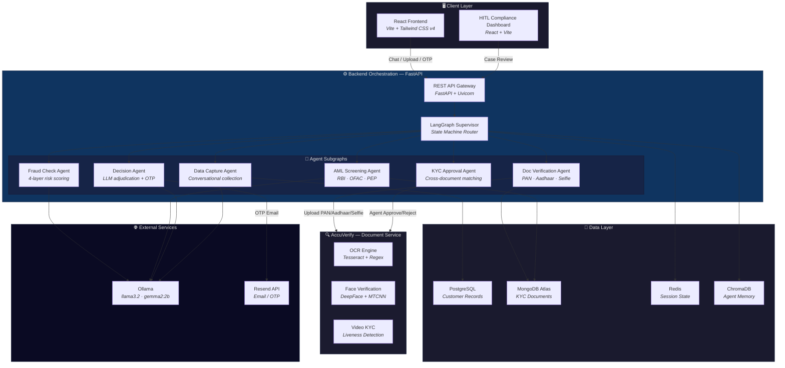
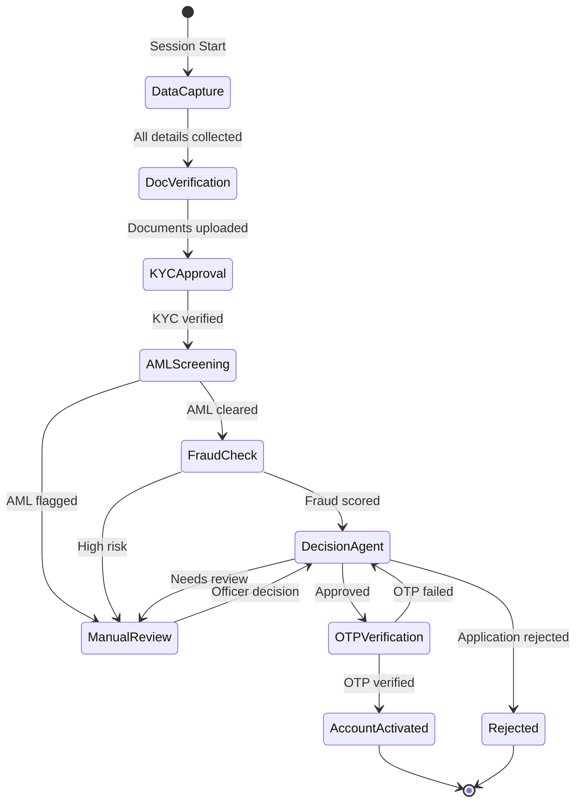

<](https://fastapi.tiangolo.com)
[](https://react.dev)
[](https://langchain-ai.github.io/langgraph/)
[](https://ollama.com)
[](https://python.org)
[](https://tailwindcss.com)
[](https://postgresql.org)
[](https://mongodb.com)
[](LICENSE)

</div>

---

## 📖 Overview

**AccuEntry** is a full-stack, production-grade account onboarding platform that replaces manual, multi-step account opening workflows with an intelligent conversational AI assistant. It orchestrates **six specialized AI agents** via a LangGraph supervisor to handle everything from data collection to fraud detection to final account activation — all running on local LLMs with zero API costs.

> A customer chats with the bot → provides details → uploads documents → AI verifies identity, screens for AML/fraud → approves or escalates → sends OTP → account activated. All in one session.

---

## ✨ Features

### 🤖 Multi-Agent Orchestration
- **Supervisor Graph** — LangGraph-powered state machine routes the onboarding flow across six specialist agents
- **Stage-driven routing** — Each agent hands off to the next based on shared state transitions
- **Parallel processing** — AML screening runs in the background while document verification proceeds

### 🔐 Identity & Document Verification
- **PAN Card OCR** — Extracts and validates PAN number, name, and date of birth via Tesseract
- **Aadhaar Card OCR** — Parses Aadhaar details with fuzzy matching against government databases
- **Selfie Liveness** — DeepFace-powered face matching between uploaded selfie and ID documents
- **Video KYC** — Real-time liveness detection for high-risk applications

### 🛡️ Compliance & Risk
- **AML Screening** — Checks against RBI Caution List, OFAC Sanctions, and PEP databases
- **4-Layer Fraud Detection** — Rule-based velocity checks → behavioral scoring → ID cross-matching → LLM risk reasoning (Gemma 2B)
- **Decision Agent** — LLM-powered final adjudication with five possible outcomes (approve, review, reject, request docs, escalate)

### 📊 Human-in-the-Loop
- **HITL Compliance Dashboard** — Real-time case review interface for compliance officers
- **Manual Override** — Flag, approve, or reject cases that require human judgement
- **Audit Trail** — Every agent decision logged as structured JSONL for regulatory compliance

### 🧠 Agent Memory
- **ChromaDB Vector Store** — Semantic memory of past interactions for improved future decisions
- **Reward-based Reranking** — Memory retrieval weighted by outcome success scores
- **PII Scrubbing** — Automatic redaction of sensitive fields before memory storage

### 📧 Activation & OTP
- **Email OTP** — SHA-256 hashed, time-limited OTP codes via Resend API
- **JWT Activation Links** — Secure, expiring account activation URLs
- **Rate Limiting** — Max 3 OTP sends per hour per session

---

## 🛠 Tech Stack

<table>
<tr>
<td align="center" width="25%">

**Backend**


</td>
<td align="center" width="25%">

**Frontend**


</td>
<td align="center" width="25%">

**AI / ML**


</td>
<td align="center" width="25%">

**Data & Infra**


</td>
</tr>
</table>

---

## 🏗️ Architecture



### Onboarding Flow



---

## 📁 Project Structure

```
AccuEntry/
├── AccuEntry_Backend/              # Core backend — FastAPI + LangGraph
│   ├── main.py                     # API gateway (chat, KYC proxy, HITL endpoints)
│   ├── supervisor.py               # LangGraph supervisor graph (routes all agents)
│   ├── state.py                    # Shared OnboardingState TypedDict
│   ├── llm_config.py               # Centralised Ollama LLM configuration
│   ├── audit_logger.py             # Structured JSONL audit trail
│   ├── memory_manager.py           # Agent memory manager (ChromaDB + in-memory)
│   ├── agents/
│   │   ├── data_capture/           # Conversational data collection agent
│   │   │   ├── data_capture.py     # LangGraph subgraph for collecting user info
│   │   │   └── data_capture_validators.py  # Field validation (PAN, phone, email)
│   │   ├── doc_verification/       # Document verification agent
│   │   │   ├── doc_verify.py       # PAN/Aadhaar/Selfie upload orchestration
│   │   │   └── kyc_approval.py     # Agent-level KYC approval logic
│   │   ├── aml/                    # Anti-Money Laundering agent
│   │   │   ├── aml_screening.py    # LangGraph subgraph for AML checks
│   │   │   ├── aml_mockdb.py       # Mock sanctions/PEP database
│   │   │   ├── aml_scoring.py      # Risk score computation
│   │   │   └── tools.py            # RBI, OFAC, sanctions check tools
│   │   ├── fraud_check/            # Fraud detection agent
│   │   │   └── fraud_check.py      # 4-layer fraud scoring (rules + LLM)
│   │   └── decision/               # Decision making agent
│   │       ├── decision_tool.py    # LLM-powered adjudication subgraph
│   │       ├── activation_service.py # JWT activation links + email
│   │       ├── otp_service.py      # OTP generation, hashing, verification
│   │       └── otp_verification.py # OTP flow handler node
│   ├── core/
│   │   ├── database.py             # PostgreSQL (SQLAlchemy) connection
│   │   ├── redis_client.py         # Redis async client
│   │   ├── chroma_memory.py        # ChromaDB vector store backend
│   │   ├── http_client_pool.py     # Shared httpx connection pool
│   │   └── mongodbase.py           # MongoDB connection
│   ├── models/
│   │   └── customer_info.py        # SQLAlchemy ORM — CustomerDetails table
│   ├── schemas/
│   │   └── chat.py                 # Pydantic models (ChatRequest/Response, etc.)
│   ├── orchestration/
│   │   └── onboarding_workflow.py  # Workflow utilities
│   ├── scripts/                    # Utility scripts
│   ├── logs/                       # Audit log output directory
│   └── requirements.txt            # Python dependencies
│
├── AccuEntry_Frontend/             # Customer-facing React app
│   ├── src/
│   │   ├── App.jsx                 # Route definitions (/, /open-account)
│   │   ├── main.jsx                # React DOM entry point
│   │   ├── index.css               # Global styles
│   │   ├── pages/
│   │   │   ├── HomePage.jsx        # Landing page — bank marketing
│   │   │   └── OpenAccountPage.jsx # Account opening page with chatbot
│   │   └── components/
│   │       ├── ChatWindow/         # Main chat interface component
│   │       ├── ChatBotWidget/      # Floating chatbot widget
│   │       ├── Header/             # Navigation header
│   │       ├── Footer/             # Page footer
│   │       ├── HeroSection/        # Landing hero banner
│   │       ├── LoginForm/          # Authentication form
│   │       ├── ProductCard/        # Product display cards
│   │       ├── QuickLinks/         # Quick navigation links
│   │       └── common/             # Shared UI components
│   ├── package.json                # Node dependencies (React 19, Vite 7)
│   └── vercel.json                 # Vercel deployment config
│
├── AccuEntry_Verify/               # Document verification microservice
│   ├── main.py                     # FastAPI — OCR, face match, video KYC
│   ├── app/
│   │   ├── face_service.py         # DeepFace face comparison
│   │   ├── ocr_service.py          # Tesseract OCR extraction
│   │   ├── identity_verify.py      # End-to-end identity verification
│   │   ├── pan_service.py          # PAN-specific parsing
│   │   ├── database.py             # MongoDB KYC record store
│   │   ├── seed_pan.py             # PAN test data seeder
│   │   ├── seed_aadhaar.py         # Aadhaar test data seeder
│   │   └── webrtc_service.py       # WebRTC video stream handler
│   ├── core/
│   │   └── redis_client.py         # Redis connection
│   ├── uploads/                    # Uploaded document storage
│   └── requirements.txt            # Python dependencies (DeepFace, OpenCV)
│
└── HITL_2/                         # Human-in-the-Loop compliance dashboard
    ├── src/
    │   ├── App.jsx                 # Dashboard layout + case table
    │   ├── main.jsx                # React entry point
    │   ├── components/
    │   │   ├── Sidebar.jsx         # Navigation sidebar
    │   │   ├── Table.jsx           # Case listing table
    │   │   ├── TableRow.jsx        # Individual case row
    │   │   └── Topbar.jsx          # Dashboard header
    │   ├── data/                   # Mock/static data
    │   └── styles/                 # Dashboard CSS
    └── package.json                # Node dependencies (React 18, Vite 5)
```

---

## 🚀 Getting Started

### Prerequisites

| Tool | Version | Purpose |
|------|---------|---------|
| **Python** | 3.11+ | Backend runtime |
| **Node.js** | 18+ | Frontend build tooling |
| **PostgreSQL** | 15+ | Customer data storage |
| **MongoDB** | 6+ (or Atlas) | KYC document storage |
| **Redis** | 7+ | Session state management |
| **Ollama** | Latest | Local LLM inference |
| **Tesseract OCR** | 5+ | Document text extraction |

### 1. Clone the Repository

```bash
git clone https://github.com/your-org/accuentry.git
cd accuentry
```

### 2. Set Up Ollama (Local LLM)

```bash
# Install Ollama: https://ollama.com/download
ollama pull llama3.2        # Primary model (data capture, AML, decision)
ollama pull gemma2:2b       # Fraud check reasoning model
ollama serve                # Start server on port 11434
```

### 3. Start the Backend

```bash
cd AccuEntry_Backend

# Create and activate virtual environment
python -m venv venv
venv\Scripts\activate        # Windows
# source venv/bin/activate   # macOS/Linux

# Install dependencies
pip install -r requirements.txt

# Configure environment
cp .env.example .env         # Copy and edit .env (see Environment Variables below)

# Run the backend server
uvicorn main:app --host 127.0.0.1 --port 8000 --reload
```

### 4. Start AccuVerify (Document Service)

```bash
cd AccuEntry_Verify

# Create and activate virtual environment
python -m venv env
env\Scripts\activate         # Windows

# Install dependencies
pip install -r requirements.txt

# Configure environment
cp .env.example .env         # Edit with MongoDB connection string

# Run the verify service
uvicorn main:app --host 127.0.0.1 --port 9000 --reload
```

### 5. Start the Frontend

```bash
cd AccuEntry_Frontend

# Install dependencies
npm install

# Run the development server
npm run dev                  # → http://localhost:5173
```

### 6. Start the HITL Dashboard (Optional)

```bash
cd HITL_2

# Install dependencies
npm install

# Run the dashboard
npm run dev                  # → http://localhost:5174
```

---

## ⚙️ Environment Variables

### AccuEntry_Backend (`.env`)

| Variable | Description | Default |
|----------|-------------|---------|
| `REDIS_URL` | Redis connection URL for session state | `redis://localhost:6379/0` |
| `DB_HOST` | PostgreSQL host | `localhost` |
| `DB_PORT` | PostgreSQL port | `5432` |
| `DB_NAME` | PostgreSQL database name | `accuentry_db` |
| `DB_USER` | PostgreSQL username | `postgres` |
| `DB_PASSWORD` | PostgreSQL password | — |
| `ACCUVERIFY_URL` | AccuVerify service URL | `http://127.0.0.1:9000` |
| `OLLAMA_MODEL` | Default Ollama model | `llama3.2` |
| `OLLAMA_BASE_URL` | Ollama server URL | `http://localhost:11434` |
| `JWT_SECRET_KEY` | Secret key for JWT activation tokens | — |
| `FRONTEND_URL` | Frontend URL (for CORS) | `http://127.0.0.1:5173` |
| `RESEND_API_KEY` | Resend API key for email/OTP dispatch | — |
| `AGENT_MEMORY_PROVIDER` | Memory backend (`chroma` or `memory`) | `chroma` |
| `CHROMA_COLLECTION_PREFIX` | ChromaDB collection namespace | `accuentry` |
| `CHROMA_EMBED_MODEL` | Sentence embedding model | `sentence-transformers/all-MiniLM-L6-v2` |
| `CHROMA_PERSIST_DIR` | ChromaDB persistence directory | `./.chroma` |
| `AGENT_MEMORY_WRITE_ENABLED` | Enable memory writes | `true` |
| `AGENT_MEMORY_RETRIEVAL_ENABLED` | Enable memory retrieval | `true` |
| `AGENT_MEMORY_REWARD_RERANK_ENABLED` | Enable reward-based reranking | `true` |
| `AGENT_MEMORY_REWARD_ALPHA` | Similarity weight for reranking | `0.8` |
| `AGENT_MEMORY_REWARD_BETA` | Reward weight for reranking | `0.2` |

### AccuEntry_Verify (`.env`)

| Variable | Description | Default |
|----------|-------------|---------|
| `REDIS_URL` | Redis connection URL | `redis://localhost:6379/0` |
| `MONGO_URL` | MongoDB Atlas connection string | — |

### HITL_2 (`.env`)

| Variable | Description | Default |
|----------|-------------|---------|
| `VITE_BACKEND_URL` | Backend API URL | `http://127.0.0.1:8000` |

---

## 📡 API Overview

### Chat & Onboarding

| Method | Endpoint | Description |
|--------|----------|-------------|
| `POST` | `/chat` | Send a chat message; returns agent response + state |
| `GET` | `/session/{id}` | Retrieve session state and details |
| `PUT` | `/session/{id}` | Update session details manually |

### KYC Document Upload (Proxied to AccuVerify)

| Method | Endpoint | Description |
|--------|----------|-------------|
| `POST` | `/kyc/pan` | Upload PAN card image for OCR verification |
| `POST` | `/kyc/aadhaar` | Upload Aadhaar card image for OCR verification |
| `POST` | `/kyc/selfie` | Upload selfie for face matching |
| `POST` | `/kyc/video-kyc` | Upload video for liveness detection |
| `POST` | `/kyc/approve` | Trigger agent-level KYC approval |

### HITL (Compliance Dashboard)

| Method | Endpoint | Description |
|--------|----------|-------------|
| `GET` | `/hitl/cases` | List all onboarding cases for review |
| `GET` | `/hitl/summary` | Get aggregate dashboard statistics |

### AccuVerify (Document Service — Port 9000)

| Method | Endpoint | Description |
|--------|----------|-------------|
| `POST` | `/upload-pan` | PAN OCR extraction + database validation |
| `POST` | `/upload-aadhaar` | Aadhaar OCR extraction + database validation |
| `POST` | `/upload-selfie` | Face comparison (selfie vs. ID photo) |
| `POST` | `/upload-video-kyc` | Video liveness verification |
| `POST` | `/agent/approve-kyc` | Agent-triggered KYC status update |
| `POST` | `/agent/reject-kyc` | Agent-triggered KYC rejection |
| `GET` | `/agent/pending-kyc` | List pending agent reviews |

---

## 🧪 Running Tests

```bash
# Backend — database connectivity
cd AccuEntry_Backend
python test_db_connection.py

# Frontend — lint
cd AccuEntry_Frontend
npm run lint
```

---

## 🤝 Contributing

1. **Fork** the repository
2. **Create** a feature branch (`git checkout -b feature/amazing-feature`)
3. **Commit** your changes (`git commit -m 'feat: add amazing feature'`)
4. **Push** to the branch (`git push origin feature/amazing-feature`)
5. **Open** a Pull Request

### Guidelines

- Follow [Conventional Commits](https://www.conventionalcommits.org/) for commit messages
- Ensure all existing tests pass before submitting a PR
- Add tests for new functionality
- Update documentation for any API changes
- Keep PRs focused — one feature or fix per PR

---

## 📄 License

This project is licensed under the **MIT License** — see the [LICENSE](LICENSE) file for details.

---

<div align="center">

**Built with ❤️ by the AccuEntry Team**

_Reimagining account onboarding with AI agents_

</div>
]]>
